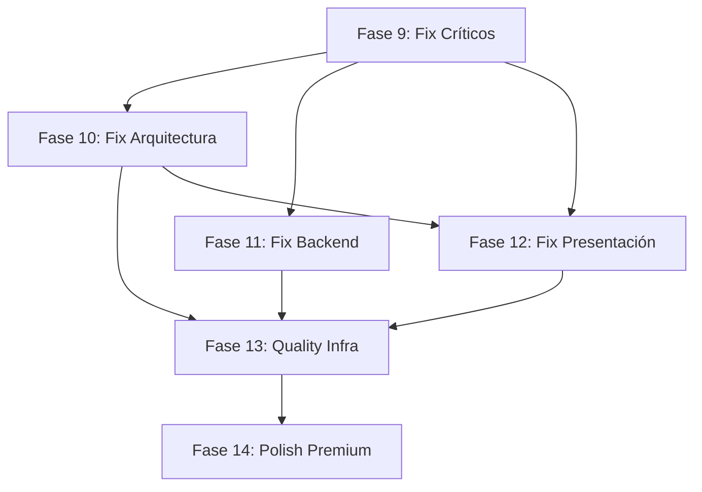

# Revisión Exhaustiva del Dashboard — Índice Maestro

## Resumen de Hallazgos por Severidad

| Capa | 🔴 Críticos | 🟡 Medios | 🟢 Leves |
|---|---|---|---|
| Arquitectura (domain/data/infra) | 9 | 10 | 8 |
| Backend (server/) | 15 | 25 | 7 |
| Presentación (pages/components/hooks) | 14 | 30 | — |
| Calidad (tests/build/docs/DX) | 8 | — | — |
| **Total** | **46** | **65** | **15** |

## Documentos de Trabajo por Fase

| Fase | Archivo | Prioridad | Esfuerzo Estimado |
|---|---|---|---|
| 🔴 **Fase 9 — Fix Críticos** | `12-PHASE-09-FIX-CRITICAL.md` | Inmediata | ~3-4 días |
| 🟡 **Fase 10 — Fix Arquitectura** | `13-PHASE-10-FIX-ARCHITECTURE.md` | Semana 2 | ~3-4 días |
| 🟡 **Fase 11 — Fix Backend** | `14-PHASE-11-FIX-BACKEND.md` | Semana 2-3 | ~5-7 días |
| 🟡 **Fase 12 — Fix Presentación** | `15-PHASE-12-FIX-PRESENTATION.md` | Semana 3-4 | ~4-5 días |
| 🟢 **Fase 13 — Quality Infra** | `16-PHASE-13-QUALITY-INFRA.md` | Semana 4 | ~3-4 días |
| 🟢 **Fase 14 — Polish Premium** | `17-PHASE-14-POLISH-PREMIUM.md` | Semana 5 | ~3-4 días |
| **Total estimado** | | | **~21-28 días** |

## Dependencias entre Fases

**Fase 9 es requisito para todas las demás.** Fases 10-12 pueden correr en paralelo si hay 2+ personas.
